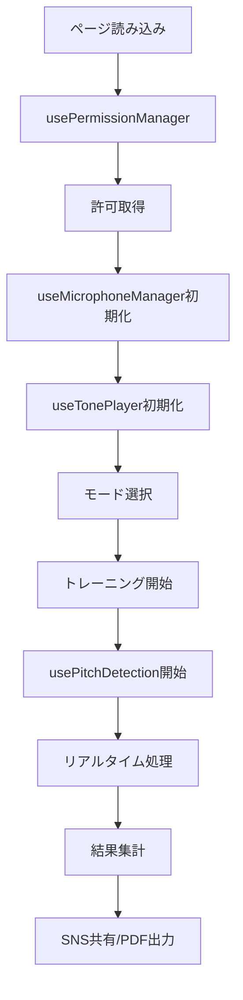

# Next.js版相対音感トレーニングアプリ 設計原則

**作成日**: 2025-07-17  
**バージョン**: v1.0.0-nextjs-design  
**対象**: Next.js + TypeScript実装版  
**ステータス**: 設計指針確定版

---

## 🎯 1. アーキテクチャ設計原則

### 1.1 技術スタック原則

#### **フレームワーク構成**
- **Next.js 15+**: App Router + Server Components
- **TypeScript**: 厳格な型安全性確保
- **Tailwind CSS**: ユーティリティファーストCSS
- **React 19+**: 最新Hooks + Concurrent Features

#### **音声処理ライブラリ**
- **Tone.js**: 基音再生（Salamander Grand Piano）
- **Pitchy**: 音程検出（McLeod Pitch Method）
- **Web Audio API**: 低レベル音声制御

#### **状態管理原則**
```typescript
// ✅ 推奨: カスタムHooks分離
const { permissionState, requestPermission } = usePermissionManager();
const { microphoneState, startRecording } = useMicrophoneManager();
const { currentPitch, isDetecting } = usePitchDetection();
const { playerState, playTone } = useTonePlayer();

// ❌ 非推奨: 複雑なContext使用
// 音声処理は独立性を重視し、Context依存を避ける
```

### 1.2 カスタムHooks設計原則

#### **音声処理4大Hook**
1. **usePermissionManager**: マイク許可管理
2. **useMicrophoneManager**: 音声入力・ノイズ処理
3. **usePitchDetection**: Pitchy統合・音程検出
4. **useTonePlayer**: Tone.js統合・基音再生

#### **Hook設計ルール**
```typescript
// ✅ 単一責任原則
interface PermissionManagerHook {
  permissionState: PermissionState;
  requestPermission: () => Promise<boolean>;
  resetPermission: () => void;
}

// ✅ 状態とアクションの明確分離
interface AudioManagerState {
  isRecording: boolean;
  audioLevel: number;
  error: string | null;
}

// ✅ エラーハンドリング内蔵
const [state, setState] = useState({
  error: null,
  isLoading: false,
  data: null
});
```

---

## 🎮 2. UI/UX設計原則

### 2.1 モダンデザイン指針

#### **視覚的階層**
- **グラデーション背景**: `bg-gradient-to-br from-blue-50 to-indigo-100`
- **カード設計**: `rounded-2xl shadow-xl` + hover effects
- **配色**: Tailwind CSS color palette準拠
- **タイポグラフィ**: font-family: Inter準拠

#### **インタラクション設計**
```tsx
// ✅ 推奨: hover + transition効果
<div className="group relative bg-white rounded-2xl shadow-xl p-8 border border-gray-100 hover:shadow-2xl transition-all duration-300 hover:scale-105">
  <div className="absolute inset-0 bg-gradient-to-br from-emerald-50 to-green-50 rounded-2xl opacity-0 group-hover:opacity-100 transition-opacity duration-300"></div>
  <div className="relative z-10">
    {/* コンテンツ */}
  </div>
</div>
```

### 2.2 レスポンシブ設計

#### **ブレークポイント戦略**
- **Mobile First**: `sm:` から設計開始
- **iPhone対応**: 375px基準最適化
- **Desktop強化**: `lg:` `xl:` での機能拡張

#### **コンポーネント構造**
```tsx
// ✅ 推奨: 小さなコンポーネント分割
<TrainingModeCard
  title="ランダム基音モード"
  description="毎回異なる基音でトレーニング"
  icon={<MusicIcon />}
  onClick={() => startMode('random')}
/>

// ❌ 非推奨: 巨大なページコンポーネント
```

---

## 🔊 3. 音声処理設計原則

### 3.1 リアルタイム処理設計

#### **パフォーマンス最適化**
```typescript
// ✅ 推奨: requestAnimationFrame使用
const processAudioData = useCallback(() => {
  if (!isDetecting) return;
  
  const audioData = getAudioData();
  if (audioData) {
    const [frequency, clarity] = detector.findPitch(audioData, sampleRate);
    updatePitchData(frequency, clarity);
  }
  
  animationFrameRef.current = requestAnimationFrame(processAudioData);
}, [isDetecting, getAudioData]);

// ❌ 非推奨: setInterval使用
```

#### **メモリ管理**
```typescript
// ✅ 推奨: 適切なクリーンアップ
useEffect(() => {
  return () => {
    if (animationFrameRef.current) {
      cancelAnimationFrame(animationFrameRef.current);
    }
    if (audioContextRef.current) {
      audioContextRef.current.close();
    }
  };
}, []);
```

### 3.2 エラーハンドリング原則

#### **段階的フォールバック**
```typescript
// ✅ 推奨: 段階的エラー処理
const requestPermission = async (): Promise<boolean> => {
  try {
    // Permissions API試行
    const result = await navigator.permissions.query({ name: 'microphone' });
    if (result.state === 'granted') return true;
    
    // getUserMedia試行
    const stream = await navigator.mediaDevices.getUserMedia({ audio: true });
    stream.getTracks().forEach(track => track.stop());
    return true;
    
  } catch (error) {
    // 詳細エラー分類
    if (error.name === 'NotAllowedError') {
      setError('マイクの許可が必要です');
    } else if (error.name === 'NotFoundError') {
      setError('マイクが見つかりません');
    }
    return false;
  }
};
```

---

## 📱 4. トレーニングモード設計原則

### 4.1 3つのモード設計

#### **1. ランダム基音モード**
```typescript
interface RandomModeConfig {
  baseToneCandidates: BaseTone[];
  randomSeed?: number;
  targetNotes: Note[];
}

// 10種類の基音からランダム選択
const BASE_TONE_CANDIDATES = [
  { note: 'C', octave: 3, frequency: 130.81 },
  { note: 'D', octave: 3, frequency: 146.83 },
  // ... 8音追加
];
```

#### **2. 5ラウンド連続モード**
```typescript
interface ContinuousModeConfig {
  rounds: number; // ユーザー選択可能（3-10）
  baseTone: BaseTone;
  progressTracking: boolean;
}

interface RoundResult {
  roundNumber: number;
  score: number;
  accuracy: number;
  completionTime: number;
}
```

#### **3. 12音クロマティックモード**
```typescript
interface ChromaticModeConfig {
  startingTone: Note; // ユーザー選択
  direction: 'up' | 'down' | 'both';
  chromaticScale: Note[];
}

const CHROMATIC_NOTES = ['C', 'C#', 'D', 'D#', 'E', 'F', 'F#', 'G', 'G#', 'A', 'A#', 'B'];
```

### 4.2 モード共通インターフェース

```typescript
interface TrainingMode {
  id: string;
  name: string;
  description: string;
  config: ModeConfig;
  start: () => Promise<void>;
  stop: () => void;
  getResults: () => TrainingResult;
}

interface TrainingResult {
  mode: string;
  score: number;
  accuracy: number;
  completionTime: number;
  detailedResults: NoteResult[];
}
```

---

## 🔄 5. データフロー設計原則

### 5.1 状態管理フロー



### 5.2 型安全性確保

```typescript
// ✅ 推奨: 厳格な型定義
type PermissionState = 'unknown' | 'checking' | 'granted' | 'denied' | 'error';
type TrainingMode = 'random' | 'continuous' | 'chromatic';
type Note = 'C' | 'C#' | 'D' | 'D#' | 'E' | 'F' | 'F#' | 'G' | 'G#' | 'A' | 'A#' | 'B';

interface PitchData {
  frequency: number;
  note: Note;
  octave: number;
  cents: number;
  clarity: number;
  isValid: boolean;
}

// ❌ 非推奨: any型の使用
```

---

## 🚀 6. パフォーマンス設計原則

### 6.1 レンダリング最適化

```typescript
// ✅ 推奨: React.memo + useMemo
const PitchVisualizer = React.memo(({ pitchData }: { pitchData: PitchData }) => {
  const displayData = useMemo(() => ({
    frequency: pitchData.frequency.toFixed(2),
    note: `${pitchData.note}${pitchData.octave}`,
    cents: pitchData.cents > 0 ? `+${pitchData.cents}` : `${pitchData.cents}`
  }), [pitchData]);

  return (
    <div className="pitch-display">
      {/* レンダリング内容 */}
    </div>
  );
});
```

### 6.2 バンドルサイズ最適化

```typescript
// ✅ 推奨: 動的インポート
const PitchTrainingComponent = lazy(() => import('./components/PitchTraining'));

// ✅ 推奨: 必要な機能のみインポート
import { PitchDetector } from 'pitchy';
import * as Tone from 'tone';
```

---

## 📦 7. ビルド・デプロイ設計原則

### 7.1 静的サイト生成

```typescript
// next.config.ts
const nextConfig = {
  output: 'export',
  trailingSlash: true,
  images: {
    unoptimized: true
  }
};
```

### 7.2 GitHub Pages対応

```json
// package.json
{
  "scripts": {
    "build": "next build",
    "export": "next build && next export",
    "github-pages": "npm run build && touch out/.nojekyll"
  }
}
```

---

**この設計原則は、Next.js版相対音感トレーニングアプリの実装において、一貫性・保守性・拡張性を確保するための指針です。**